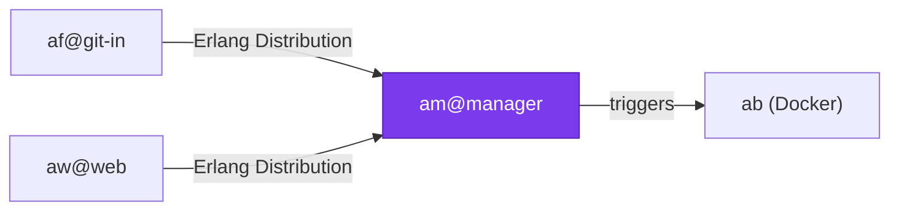

# Erlang Distribution

All Applikant components communicate via **Erlang's built-in distribution mechanism**. This page explains how it works and how it is configured.

## How It Works

Erlang/OTP has native support for distributed computing. Erlang nodes can transparently send messages to processes on other nodes — no HTTP APIs, no message brokers, no serialization libraries needed.



## Node Names

Each component runs as a named Erlang node using **short names** (`-sname`):

| Component | Node Name | Configured In |
|---|---|---|
| am (Manager) | `am@<hostname>` | `am/config/vm.args` |
| af (Frontend) | `af@<hostname>` | `af/config/vm.args` |
| aw (Web Frontend) | `aw@<hostname>` | `aw/config/vm.args` |
| as (SSH) | `as_<pid>@<hostname>` | Dynamic (per invocation) |
| ah (git Hooks) | `ah_<pid>@<hostname>` | Dynamic (per invocation) |

!!! note "Short names vs. long names"
    Applikant uses **short names** (`-sname`), which means all nodes must be in the same DNS domain or on the same machine. For cross-network deployments, you would switch to long names (`-name`).

## Erlang Cookie

All nodes in the cluster must share the **same Erlang cookie**. This is a simple shared secret that acts as a cluster membership token.

The cookie is configured as `applikant_cookie` in each component's `vm.args`:

```
-setcookie applikant_cookie
```

!!! warning
    In production, use a strong random cookie and distribute it securely. The cookie is **not** encryption — it only prevents accidental cross-cluster connections.

## How Components Connect

### OTP Applications (am, af, aw)

These run permanently and connect to each other at startup:

```erlang
%% In af or aw, connecting to the manager:
net_adm:ping('am@manager').
global:sync().
```

### Escripts (as, ah)

These are short-lived processes. On every invocation, they:

1. Start a temporary Erlang node with a unique name (e.g. `as_12345@host`)
2. Set the cookie
3. Ping the local `af` node
4. Make a single `gen_server:call` to the globally registered service
5. Exit

```erlang
%% In as.erl:
MyName = list_to_atom("as_" ++ os:getpid()),
net_kernel:start([MyName, shortnames]),
erlang:set_cookie(node(), applikant_cookie),
net_adm:ping('af@git-in'),
global:sync(),
af_auth:check_access(User, Repo, Access).
```

## Global Process Registration

Key services register themselves globally so that any node in the cluster can call them by name:

| Process | Module | Registered As |
|---|---|---|
| Hook API | `am_hook_api` | `{global, am_hook_api}` |
| User DB | `am_user_db` | `{global, am_user_db}` |
| Hook Server | `af_hook_server` | `{global, af_hook_server}` |
| Auth Service | `af_auth` | `{global, af_auth}` |
| Repo Manager | `af_repo_manager` | `{global, af_repo_manager}` |

This means `as` does not need to know which specific node `af_auth` runs on — it just calls `{global, af_auth}` and Erlang routes the message.

## EPMD

Erlang uses **EPMD** (Erlang Port Mapper Daemon) to discover nodes. EPMD runs automatically on port 4369. For distribution to work:

- EPMD must be running on each host
- Port 4369 must be accessible between hosts
- The Erlang distribution ports (dynamic, typically 9100–9200) must be accessible

!!! tip "Firewall configuration"
    You can restrict the distribution port range in `vm.args`:
    ```
    -kernel inet_dist_listen_min 9100
    -kernel inet_dist_listen_max 9200
    ```

