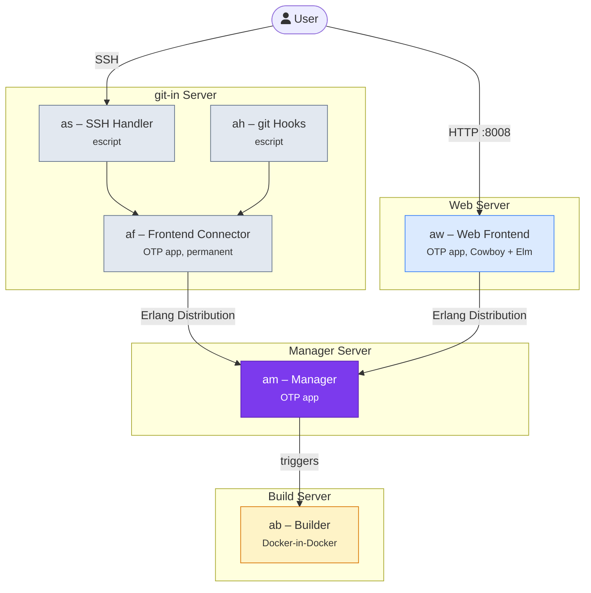
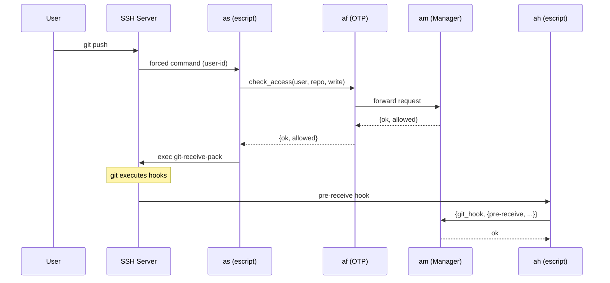
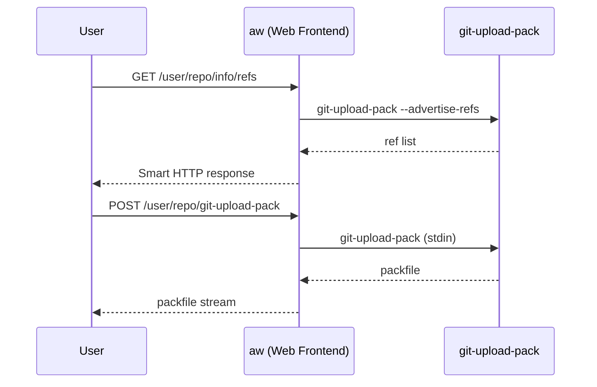

# Architecture Overview

!!! note "Concept"
    This page describes the **target architecture**. Not all connections and features are fully implemented yet — see the [Development Status](../development/status.md) for details.

Applikant is a **distributed system** built from several loosely coupled Erlang/OTP components. Each component runs as its own Erlang node, and they communicate via Erlang's built-in distribution mechanism.

## System Diagram



## Data Flow

### Git Push via SSH



### Git Clone via HTTP (read-only)



## Deployment

All components can run on a **single machine** or be **distributed across multiple hosts**. The only requirement is that the Erlang nodes can reach each other and share the same cookie.

### Single Machine

```
┌─────────────────────────────────────────┐
│  Host                                   │
│                                         │
│  af@host  ←→  am@host  ←→  aw@host     │
│                  ↓                      │
│              ab (Docker)                │
└─────────────────────────────────────────┘
```

### Multi-Machine

```
┌──────────────┐   ┌──────────────┐   ┌──────────────┐
│  git-in      │   │  manager     │   │  web         │
│  af@git-in   │──▶│  am@manager  │◀──│  aw@web      │
│  as, ah      │   │              │   │  Port 8008   │
└──────────────┘   └──────┬───────┘   └──────────────┘
                          │
                   ┌──────▼───────┐
                   │  builder     │
                   │  ab (Docker) │
                   └──────────────┘
```

## Design Principles

- **Manager is the single source of truth** — all authorization decisions flow through `am`
- **SSH is the only write path** — pushes always go through SSH, never HTTP
- **Escripts are thin wrappers** — `as` and `ah` do as little as possible, delegating to `af`/`am`
- **Fault tolerance via OTP** — supervisors restart failed components automatically
- **Loose coupling** — components can be started and stopped independently

