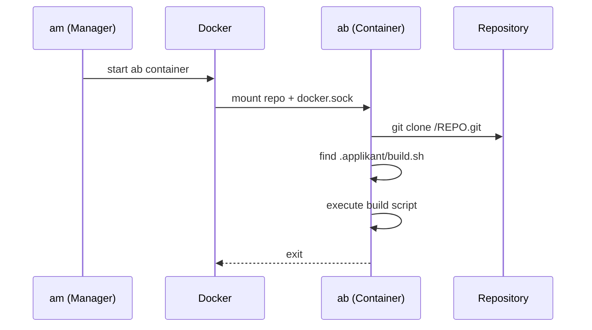

# ab – Builder

Docker-based build service. Runs project builds inside Docker containers (Docker-in-Docker), triggered by the Manager after a successful push.

## How It Works



1. The Manager starts the builder container with the repository mounted
2. `build.sh` clones the mounted bare repository
3. Searches for `.applikant/build.sh` in the cloned repo
4. If present: executes the build script (which can build Docker images)
5. If absent: aborts with error

## Project Requirements

For a repository to be buildable, it must contain:

```
.applikant/
└── build.sh    # Build script — defines how the project is built
```

## Usage

```bash
docker run -it \
  -v /path/to/repo.git/:/REPO.git/ \
  -v /var/run/docker.sock:/var/run/docker.sock \
  applikant/builder
```

| Mount | Description |
|---|---|
| `/REPO.git/` | Git bare repository to build |
| `/var/run/docker.sock` | Docker socket for Docker-in-Docker |

## Build the Docker Image

```bash
cd applikant.builder
docker build -t applikant/builder .
```

Base image: `debian` with `git` and `docker.io`.

## Status

!!! warning "Work in progress"
    Basic Docker build works. Integration with the Manager (automatic trigger after push) is not yet implemented.

