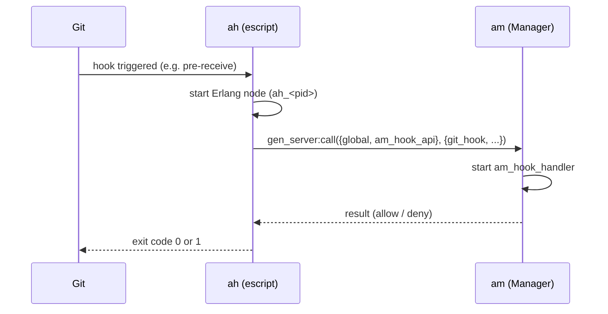

# ah – Git Hooks

Escript that is installed as a **universal git hook** in all managed repositories. On every hook invocation, `ah` connects to the Manager (`am`) and asks whether the action is permitted.

## How It Works



1. Git triggers a hook (e.g. `pre-receive`, `update`, `post-update`)
2. `ah` starts as an escript with a unique node name (`ah_<PID>@<host>`)
3. Connects to the Manager via `net_adm:ping` and `global:sync()`
4. Calls `gen_server:call({global, am_hook_api}, {git_hook, {Hook, Args, Env, CWD}})`
5. The Manager decides and responds — `ah` returns the result to git

## Data Sent to the Manager

| Field | Description |
|---|---|
| `Hook` | Name of the hook (e.g. `"hooks/pre-receive"`) |
| `Args` | Hook arguments (branch name, old/new hash) |
| `Env` | Filtered environment variables (`GIT_*`, `PWD`) |
| `CWD` | Current working directory (path to the repository) |

## Installation

`ah` is linked or copied as **all** hook files into the `hooks/` directory of each bare repository. Since `ah` determines the hook name from `escript:script_name()`, a single binary works for all hook types.

```bash
cd /path/to/repo.git/hooks
for hook in pre-receive update post-update post-receive; do
    ln -sf /home/git/ah $hook
done
```

## Build

```bash
cd applikant.git-in/ah
rebar3 escriptize
cp _build/default/bin/ah /home/git/ah
```

## Planned: Communication via `af`

Currently `ah` connects directly to the Manager. In the future, it should communicate locally with `af`, eliminating the expensive node startup per invocation.

## Status

!!! warning "Work in progress"
    Basic hook communication with the Manager works. Real permission logic in the Manager is not yet implemented.

