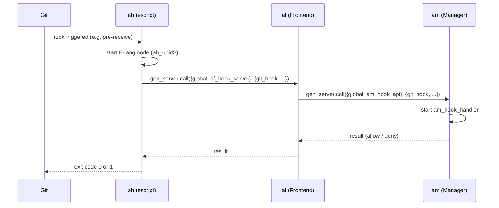

# ah – Git Hooks

Escript that is installed as a **universal git hook** in all managed repositories. On every hook invocation, `ah` connects to the local Frontend Connector (`af`) which forwards the request to the Manager (`am`).

## How It Works



1. Git triggers a hook (e.g. `pre-receive`, `update`, `post-update`)
2. `ah` starts as an escript with a unique node name (`ah_<PID>@<host>`)
3. Connects to the local `af` node via `net_adm:ping`
4. Calls `gen_server:call({global, af_hook_server}, {git_hook, HookData})`
5. `af` forwards the request to the Manager (`am`) and returns the result — `ah` passes it back to git

## Data Sent to af

| Field | Description |
|---|---|
| `hook` | Name of the hook (e.g. `"hooks/pre-receive"`) |
| `args` | Hook arguments (branch name, old/new hash) |
| `stdin` | Data read from stdin (ref data for pre-receive etc.) |
| `env` | Filtered environment variables (`GIT_*`, `PWD`) |
| `cwd` | Current working directory (path to the repository) |

## Installation

`ah` is linked or copied as **all** hook files into the `hooks/` directory of each bare repository. Since `ah` determines the hook name from `escript:script_name()`, a single binary works for all hook types.

```bash
cd /path/to/repo.git/hooks
for hook in pre-receive update post-update post-receive; do
    ln -sf /home/git/ah $hook
done
```

## Build

```bash
cd applikant.git-in/ah
rebar3 escriptize
cp _build/default/bin/ah /home/git/ah
```

## Configuration

| Environment Variable | Default | Description |
|---|---|---|
| `APPLIKANT_COOKIE` | `applikant_cookie` | Erlang distribution cookie |
| `APPLIKANT_AF_NODE` | `af@localhost` | Erlang node name of the local `af` instance |

## Status

!!! warning "Work in progress"
    Basic hook communication via `af` to the Manager works. Real permission logic in the Manager is not yet implemented.

