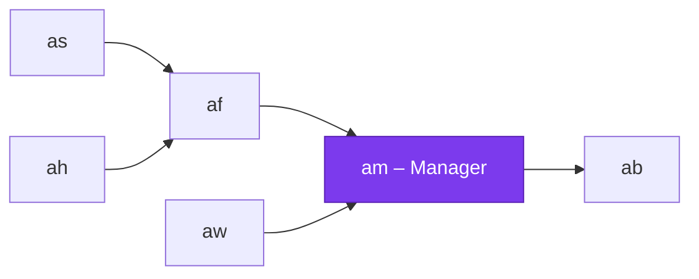

# am – Manager

The **central instance** of the Applikant system. The Manager is an OTP application that manages all information about repositories, users and permissions. All other components communicate with it — it **decides** whether an action is allowed or not.

## Role in the System



- **as** (SSH) connects to **af** to check user authorization
- **af** (Frontend) maintains a permanent connection to **am** and forwards requests from both `as` and `ah`
- **ah** (git hooks) connects locally to **af** which forwards hook data to the Manager
- **aw** (Web Frontend) connects to **am** to display and manage repositories
- **ab** (Builder) is triggered by the Manager to run builds

## Supervision Tree

```
am_sup (one_for_one)
├── am_node_observer         (worker, permanent)
├── am_hook_handler_sup      (supervisor, simple_one_for_one)
│   └── am_hook_handler      (worker, temporary – one per hook call)
└── am_hook_api              (worker, permanent, globally registered)
```

## Modules

| Module | Type | Description |
|---|---|---|
| `am_app` | Application | OTP application callback |
| `am_sup` | Supervisor | Top-level supervisor |
| `am` | API | Entry point for git hook calls |
| `am_hook_api` | gen_server | Globally registered — receives hook requests from `ah` |
| `am_hook_handler_sup` | Supervisor | `simple_one_for_one` — starts a handler per hook call |
| `am_hook_handler` | gen_server | Processes an individual git hook (temporary worker) |
| `am_node_observer` | gen_server | Monitors connecting/disconnecting Erlang nodes |

## Git Hook Processing

When a git hook is triggered:

1. `ah` calls `af_hook_server:handle_hook(HookData)` on the local `af` node
2. `af_hook_server` forwards the request to `gen_server:call({global, am_hook_api}, {git_hook, {Hook, Args, Env, CWD}})`
3. `am_hook_api` starts a new `am_hook_handler` via `am_hook_handler_sup`
4. The handler processes the hook asynchronously and replies back through `af` to `ah`

**Supported hooks:**

| Hook | Behavior |
|---|---|
| `pre-receive` | Validates incoming pushes, access to quarantine path |
| `update` | Per-ref validation |
| `post-update` | Triggers builder, notifications |

## Build & Run

```bash
cd applikant.manager/am
rebar3 shell
```

The Manager starts as node `am@<hostname>` with cookie `applikant_cookie`.

