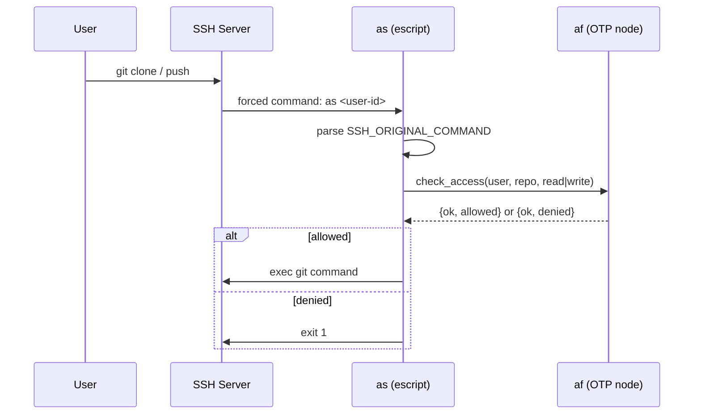

# as – SSH Handler

Erlang escript that acts as an **SSH forced command**. It is registered in `~/.ssh/authorized_keys` and ensures that only git commands are allowed — no shell access. `as` is a **thin wrapper** that delegates all authorization to `af`.

## How It Works



## Setup

### 1. Build

```bash
cd applikant.git-in/as
rebar3 escriptize
cp _build/default/bin/as /home/git/as
chmod +x /home/git/as
```

### 2. Configure `authorized_keys`

Each SSH key gets an entry with `as` as the forced command and a **user ID** as argument:

```
command="/home/git/as user-42",no-port-forwarding,no-X11-forwarding,no-agent-forwarding,no-pty ssh-rsa AAAAB3... alice@laptop
command="/home/git/as user-73",no-port-forwarding,no-X11-forwarding,no-agent-forwarding,no-pty ssh-rsa AAAAB3... bob@workstation
```

| Part | Meaning |
|---|---|
| `command="/home/git/as user-42"` | Run `as` with user ID instead of a shell |
| `no-port-forwarding,...,no-pty` | Disable everything except the forced command |
| `user-42` | Placeholder for the user ID (later from auth module) |

### 3. Erlang Cookie

`as` and `af` must share the same cookie (`applikant_cookie`).

## Allowed Commands

| `SSH_ORIGINAL_COMMAND` | Git Operation | Access Type |
|---|---|---|
| `git-upload-pack '<repo>.git'` | clone, fetch, pull | `read` |
| `git-receive-pack '<repo>.git'` | push | `write` |

Everything else is rejected with exit code 1.

## User ID

The user ID is passed as the first argument:

```
/home/git/as user-42
```

It is forwarded to `af_auth:check_access/3`. Currently a placeholder — later managed automatically by the authorization module.

## Example

```bash
# Alice clones:
$ git clone ssh://git@server/team/project.git
# → SSH_ORIGINAL_COMMAND=git-upload-pack 'team/project.git'
# → /home/git/as user-42
# → af_auth:check_access(<<"user-42">>, <<"team/project.git">>, read)
# → {ok, allowed} → git-upload-pack executed

# Bob pushes:
$ git push ssh://git@server/team/project.git
# → SSH_ORIGINAL_COMMAND=git-receive-pack 'team/project.git'
# → /home/git/as user-73
# → af_auth:check_access(<<"user-73">>, <<"team/project.git">>, write)
```

## Status

!!! warning "Work in progress"
    Authorization in `af_auth` allows everything. Actual git command execution is TODO. Cookie and node name are hardcoded.

