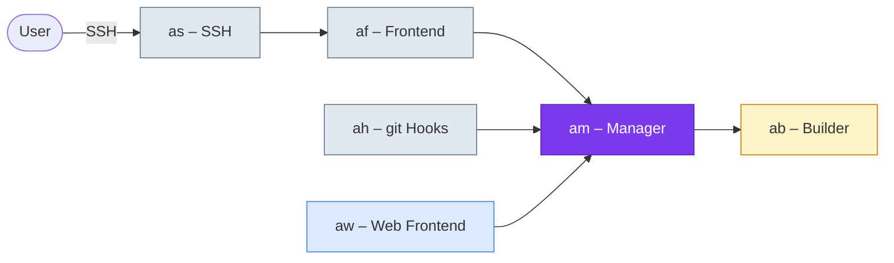

# Applikant

**Self-hosted git repository management — built with Erlang/OTP and Elm.**

---

Applikant is a self-hosted git repository management platform — similar to Gitea or Gogs, but built entirely in **Erlang/OTP** and **Elm**. Thanks to Erlang's built-in distribution capabilities, Applikant can be spread across multiple machines with minimal effort. The web frontend is written in Elm, a functional language that compiles to JavaScript and guarantees zero runtime exceptions, resulting in a fast and reliable user interface.

Applikant gives you full control over your source code without relying on third-party services.

## Architecture at a Glance

## Components

| Component | Type | Description |
|---|---|---|
| **[am – Manager](components/am.md)** | OTP Application | Central instance — repos, users, permissions, hook processing |
| **[af – Frontend Connector](components/af.md)** | OTP Application | Permanent local proxy between escripts and the Manager |
| **[as – SSH Handler](components/as.md)** | Escript | SSH forced command — authorizes users, allows only git commands |
| **[ah – Git Hooks](components/ah.md)** | Escript | Universal git hook handler — asks the Manager for permission |
| **[aw – Web Frontend](components/aw.md)** | OTP Application | Cowboy HTTP server with Elm UI and read-only git HTTP |
| **[ab – Builder](components/ab.md)** | OTP Application | Docker-in-Docker build service |

## Vision

Applikant aims to be a lightweight, robust and easily deployable git platform. Leveraging the fault-tolerance of Erlang/OTP, all components form a cluster where failures are isolated and services restart automatically. Simply start the components on different hosts and they will connect and collaborate.

The long-term goal is a batteries-included solution for small teams and personal projects — repository hosting, access control, webhooks and continuous integration, all in one package.

## Technology Stack

| Technology | Usage |
|---|---|
| **Erlang/OTP 27** | All backend components |
| **Elm 0.19** | Web frontend |
| **Cowboy** | HTTP server |
| **Rebar3** | Erlang build tool |
| **Docker** | Containerization |
| **Erlang Distribution** | Inter-node communication |

## License

Source code is released under the [GNU Affero General Public License v3 (AGPL-3.0)](license.md#source-code-agpl-30). Documentation is licensed under [CC BY-SA 4.0](license.md#documentation-cc-by-sa-40).

